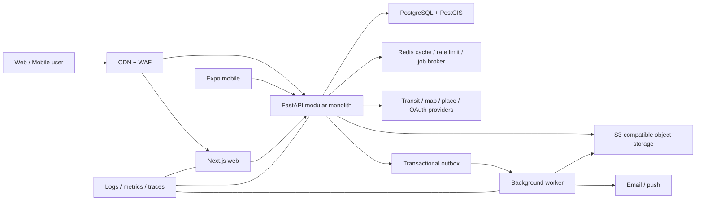

# 시스템 아키텍처

## 목표 구조



`CONFIRMED` 현행은 Vite SPA, FastAPI, MySQL, 로컬 미디어, 정적 교통 데이터와 GitHub Pages 프론트 배포다. 위 그림은 독립 버전의 목표 구조다.

## 저장소 구조

```text
apps/
├─ web/                 Next.js 웹
└─ mobile/              Expo React Native 앱
services/
├─ api/                 FastAPI 모듈러 모놀리스
└─ worker/              동일 Python 패키지를 사용하는 비동기 작업 실행기
packages/
├─ contracts/           OpenAPI 산출물, 생성 TypeScript 클라이언트
├─ design-tokens/       색·간격·타이포·노선 표현 토큰
├─ eslint-config/       JS/TS 공통 검사
└─ test-fixtures/       계약·E2E용 비민감 픽스처
db/
├─ migrations/          Alembic 마이그레이션
├─ seeds/               버전·출처가 있는 마스터 데이터
└─ docs/                ERD와 데이터 사전
infra/
├─ docker/              로컬 개발
├─ environments/        dev/staging/prod IaC
└─ observability/       대시보드·알림 정의
docs/                    제품·운영·ADR
```

`packages/contracts`는 손으로 중복 타입을 작성하는 곳이 아니다. FastAPI OpenAPI를 CI에서 검증하고 웹·모바일 클라이언트를 생성한다. UI 전용 view model은 각 앱에 둔다.

## 기술 스택 결정

| 계층 | 선택 | 이유 | 기각/보류 |
|---|---|---|---|
| 웹 | Next.js App Router + TypeScript | 공개 상세 SSR/SEO, 라우팅·메타데이터·캐시 일관성 | Vite SPA는 내부 도구에는 단순하지만 공개 콘텐츠와 직접 URL 복원이 약함 |
| 모바일 | React Native + Expo | 웹 팀의 TS 역량 재사용, 위치·푸시·딥링크 | PWA만으로 백그라운드·푸시·현장 UX 한계 |
| API | FastAPI + SQLAlchemy + Alembic | 현행 역량 재사용, 명시적 계약, 비동기 I/O | 초기 마이크로서비스 분리는 트랜잭션·운영 비용 증가 |
| DB | PostgreSQL + PostGIS | 역/장소 거리·공간 인덱스, FTS, 제약·JSON 보조 기능 | MySQL도 가능하지만 공간/검색 통합에서 Postgres가 유리; Oracle 이중화 제외 |
| 캐시/작업 | Redis | 속도 제한, 짧은 캐시, 작업 전달 | 필수 데이터 원장으로 사용하지 않음 |
| 파일 | S3 호환 객체 저장소 + CDN | 직접 업로드, 변형, 수명주기 | API 로컬 디스크는 다중 인스턴스에서 불가 |
| 배포 | 관리형 컨테이너 + 관리형 Postgres | 작은 팀의 운영 부담 최소화 | Kubernetes는 실제 확장 요구 전 보류 |

정확한 제품/라이브러리 버전은 구현 착수 시 안정 버전을 잠그고 자동 업데이트 정책을 적용한다.

## 모듈 경계

| 모듈 | 소유 데이터 | 제공 기능 |
|---|---|---|
| identity | 사용자, 계정, 세션, 약관 | 인증·프로필·권한 |
| transit | 노선, 역, 운행 캘린더, 시간표 | 검색·노선도·시간표·경로 입력 |
| discovery | 장소, 출처, 역 거리, 미디어 | 지도·장소 검색·필터 |
| routing | 경로 계산 결과, 알고리즘 버전 | 대안 계산·근거 표시 |
| planning | 계획, 일자, 항목, 공유 링크 | CRUD·검증·복제 |
| reviews | 후기, 태그, 반응, 미디어 링크 | 작성·검색·상세 |
| community | 글, 댓글, 모집, 신청 | 토론·동행 상태 관리 |
| notifications | 알림, 선호, 전송 | 인앱·푸시·이메일 |
| moderation | 신고, 조치, 감사 | 운영 정책 집행 |

모듈은 같은 프로세스와 DB를 사용하되 다른 모듈의 테이블을 임의로 수정하지 않는다. 읽기 조합은 애플리케이션 서비스 또는 명시적 read model에서 수행한다.

## 동기·비동기 경계

동기 처리:

- 로그인, 조회, 계획 편집, 모집 신청/수락
- DB 제약과 즉시 사용자 피드백이 필요한 작업

비동기 처리:

- 이메일·푸시, 이미지 변형, 조회수 집계, 검색 색인, 외부 데이터 동기화
- API 트랜잭션에서 outbox 이벤트를 함께 저장하고 워커가 멱등 소비한다.

## 외부 연동 정책

- 외부 제공자 ID를 도메인 기본키로 사용하지 않는다.
- 제공자별 adapter와 원본 응답 해시·동기화 시각을 기록한다.
- 호출 실패 시 마지막 성공 데이터와 기준 시각을 제공하되 실시간처럼 표시하지 않는다.
- 지도 SDK 키는 허용 도메인/앱 서명으로 제한한다.
- 장소·시간표 라이선스와 재배포 가능 범위를 데이터 소스 등록 시 확인한다.

## 확장 기준

다음이 측정되기 전에는 서비스를 분리하지 않는다.

- 모듈별 독립 배포가 장애·속도 문제를 실제로 해결함
- 팀 소유권이 분리되어 같은 릴리스 주기가 병목임
- DB 부하가 모듈별로 격리해야 할 수준임
- 분산 트랜잭션·운영 비용을 감당할 관측·플랫폼 역량이 있음

