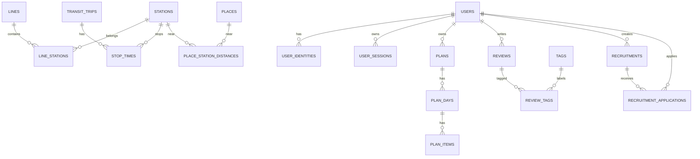

# 데이터베이스 설계

## 1. 원칙

- PostgreSQL을 단일 원장으로 사용하고 거리 검색은 PostGIS `geography(Point,4326)`로 처리한다.
- 기본키는 `uuid`, 외부 데이터 키는 별도 매핑 테이블에 둔다.
- 금액은 `integer` 원 단위, 평점은 1~10 정수, 시각은 `timestamptz`, 서비스 날짜는 `date`다.
- 모든 변경 가능 테이블은 `created_at`, `updated_at`을 갖고, 사용자 콘텐츠는 필요 시 `deleted_at`을 갖는다.
- API enum과 DB `CHECK`/enum을 한 계약으로 관리한다.
- 애플리케이션 유일성 검사만 믿지 않고 DB UNIQUE를 둔다.
- 위치 원본과 콘텐츠 본문은 로그·분석 테이블에 복제하지 않는다.

## 2. 핵심 관계

## 3. 인증·사용자

| 테이블 | 핵심 컬럼 | PK/FK·UNIQUE | 삭제·인덱스 |
|---|---|---|---|
| `users` | `id`, `email`, `display_name`, `nickname`, `status`, `profile_media_id`, `version` | PK `id`; UQ lower(email), lower(nickname); FK profile media SET NULL | 탈퇴 시 PII 익명화 또는 예약 삭제; index status |
| `user_identities` | `id`, `user_id`, `type`, `provider_subject`, `password_hash`, `verified_at` | FK user CASCADE; UQ `(type,provider_subject)`; PASSWORD는 user당 1개 partial UQ | 사용자 삭제 CASCADE; password hash 조회는 user/type |
| `user_sessions` | `id`, `user_id`, `token_family_id`, `refresh_hash`, `device_id`, `expires_at`, `revoked_at`, `replaced_by_id`, `last_seen_at` | FK user CASCADE, replaced SET NULL; UQ refresh_hash | `(user_id,revoked_at)`, `(family,revoked_at)`, expires 정리 |
| `user_agreements` | `id`, `user_id`, `agreement_type`, `document_version`, `agreed`, `agreed_at` | FK user CASCADE; UQ `(user_id,type,version)` | user/time index; 이력 보존 정책 적용 |
| `verification_challenges` | `id`, `user_id?`, `email`, `purpose`, `code_hash`, `attempts`, `expires_at`, `verified_at` | FK user SET NULL | `(email,purpose,created_at desc)`, TTL 하드 삭제 |
| `devices` | `id`, `user_id`, `platform`, `push_token_ciphertext`, `push_token_hash`, `app_version`, `last_seen_at`, `disabled_at` | FK user CASCADE; UQ token_hash | `(user_id,disabled_at)`; 로그아웃/무효 토큰 정리 |
| `roles` | `code`, `name`, `system_role` | PK code | 운영 정의, 사용 중 삭제 금지 |
| `role_scopes` | `role_code`, `scope` | 복합 PK; FK role CASCADE | scope index |
| `user_roles` | `user_id`, `role_code`, `granted_by`, `granted_at` | 복합 PK; FK user CASCADE, role RESTRICT, granted_by SET NULL | role/user index; 부여 감사 |

`users.email`은 로그인 식별과 연락 주소를 분리할 필요가 생기면 P1에서 `user_emails`로 분리한다. 초기에는 검증된 단일 이메일로 제한한다.

## 4. 데이터 출처·지하철

| 테이블 | 핵심 컬럼 | PK/FK·UNIQUE | 삭제·인덱스 |
|---|---|---|---|
| `data_sources` | `id`, `code`, `name`, `license_url`, `source_url`, `last_synced_at`, `data_version` | UQ code | 운영자가 retired; 삭제 금지 |
| `lines` | `id`, `slug`, `name`, `short_name`, `color`, `region`, `active_from/to`, `source_id` | FK source RESTRICT; UQ slug | `(region,active_to)`, display order |
| `stations` | `id`, `slug`, `name`, `region`, `location`, `address`, `active_from/to`, `source_id` | FK source RESTRICT; UQ slug | GiST location, trigram lower(name), active |
| `station_external_ids` | `id`, `station_id`, `source_id`, `external_id`, `payload_hash` | FK station CASCADE, source RESTRICT; UQ `(source_id,external_id)` | station/source index |
| `line_stations` | `id`, `line_id`, `station_id`, `branch_code`, `sequence`, `distance_from_origin_m` | FK line/station RESTRICT; UQ `(line_id,branch_code,sequence)`, UQ `(line_id,branch_code,station_id)` | line/branch/sequence |
| `service_calendars` | `id`, `source_id`, `service_code`, 요일 bool, `start_date/end_date` | UQ `(source,service_code,start_date)` | date range GiST, source |
| `service_exceptions` | `id`, `calendar_id`, `service_date`, `exception_type` | FK calendar CASCADE; UQ `(calendar,date)` | service_date |
| `transit_trips` | `id`, `line_id`, `calendar_id`, `external_trip_id`, `direction`, `headsign`, `service_class` | FK line/calendar RESTRICT; UQ `(calendar,external_trip_id)` | `(line,direction,calendar)` |
| `stop_times` | `id`, `trip_id`, `station_id`, `stop_sequence`, `arrival_offset_seconds?`, `departure_offset_seconds?` | FK trip CASCADE, station RESTRICT; UQ `(trip,stop_sequence)`, 시간 하나 이상 CHECK | `(station,departure_offset)`, trip sequence |

`service_calendars`와 예외 날짜가 현행 `WEEKDAY/WEEKEND`와 `SATURDAY/HOLIDAY` 충돌을 해소한다. 자정 이후 운행은 서비스 날짜 시작 기준 offset seconds로 저장해 `24:10` 같은 운행 시각을 잃지 않는다.

## 5. 장소·미디어·즐겨찾기

| 테이블 | 핵심 컬럼 | PK/FK·UNIQUE | 삭제·인덱스 |
|---|---|---|---|
| `places` | `id`, `name`, `category`, `description`, `address`, `location`, `phone`, `status`, `source_id`, `source_updated_at`, `version` | FK source RESTRICT | GiST location, category/status, trigram name; referenced면 RETIRED |
| `place_external_ids` | `id`, `place_id`, `source_id`, `external_id`, `payload_hash` | FK place CASCADE; UQ `(source,external_id)` | place/source |
| `place_station_distances` | `place_id`, `station_id`, `distance_m`, `walking_minutes?`, `computed_at`, `algorithm_version` | 복합 PK; FK place/station CASCADE/RESTRICT | `(station,distance_m)`, `(place,distance_m)` |
| `media_assets` | `id`, `owner_user_id?`, `storage_key`, `mime_type`, `size_bytes`, `status`, `width/height`, `sha256`, `deleted_at` | FK owner SET NULL; UQ storage_key | owner/status, sha256; 고아 TTL |
| `place_media` | `place_id`, `media_id`, `position`, `alt_text`, `source_url?` | FK place/media CASCADE/RESTRICT; UQ `(place,position)`, UQ media | place order |
| `favorite_stations` | `user_id`, `station_id`, `created_at` | 복합 PK; FK user CASCADE, station RESTRICT | user/time |
| `favorite_places` | `user_id`, `place_id`, `created_at` | 복합 PK; FK user CASCADE, place RESTRICT | user/time |

장소 반경은 매 요청마다 전수 계산하지 않고 PostGIS로 후보를 찾은 뒤, 자주 쓰는 역-장소 거리를 `place_station_distances`에 버전과 함께 물리화한다.

## 6. 여행 계획

| 테이블 | 핵심 컬럼 | PK/FK·UNIQUE | 삭제·인덱스 |
|---|---|---|---|
| `plans` | `id`, `owner_user_id`, `title`, `start_date`, `end_date`, `time_zone`, `status`, `visibility`, `source_plan_id?`, `version`, `deleted_at` | FK owner CASCADE/정책 전환, source SET NULL; date CHECK | `(owner,status,start_date)`, visibility/update |
| `plan_days` | `id`, `plan_id`, `date`, `position`, `title?` | FK plan CASCADE; UQ `(plan,date)`, UQ `(plan,position)` | plan position |
| `plan_items` | `id`, `plan_day_id`, `position`, `item_type`, `station_id?`, `place_id?`, `arrival_at?`, `departure_at?`, `duration_minutes?`, `memo` | FK day CASCADE, station/place RESTRICT; UQ `(day,position)`; type별 참조 CHECK | day/position, station, place |
| `plan_route_segments` | `id`, `plan_id`, `from_item_id?`, `to_item_id?`, `route_snapshot jsonb`, `algorithm_version`, `data_version` | FK plan CASCADE, items SET NULL | plan index; snapshot 불변 |
| `plan_share_links` | `id`, `plan_id`, `token_hash`, `expires_at`, `revoked_at`, `created_by` | FK plan CASCADE, user CASCADE; UQ token_hash | active token partial index |

계획 항목은 현행처럼 `visit_time`으로 순서를 추론하지 않는다. `position`이 순서 원장이고 시간은 선택적 제약이다. 날짜가 없던 현행 모델도 `plan_days`로 해소한다.

## 7. 후기·태그·반응

| 테이블 | 핵심 컬럼 | PK/FK·UNIQUE | 삭제·인덱스 |
|---|---|---|---|
| `reviews` | `id`, `author_user_id?`, `title`, `body_json`, `body_text`, `start_station_id?`, `end_station_id?`, `plan_id?`, `plan_snapshot?`, `rating_x2`, `travel_cost_krw?`, `view_count`, `helpful_count`, `visibility`, `version`, `deleted_at` | FK author SET NULL, station RESTRICT, plan SET NULL; rating 1..10, cost >=0 | created/id, author, stations, GIN FTS, helpful |
| `review_media` | `review_id`, `media_id`, `position`, `caption?` | FK review CASCADE, media RESTRICT; UQ `(review,position)`, UQ media | review order |
| `tags` | `id`, `type`, `canonical_name`, `display_name`, `usage_count` | UQ `(type,canonical_name)` | prefix/trigram canonical |
| `review_tags` | `review_id`, `tag_id`, `position` | 복합 PK; FK 양쪽 CASCADE/RESTRICT; UQ `(review,position)` | tag/review, 최대 5는 서비스+trigger 선택 |
| `review_reactions` | `review_id`, `user_id`, `type`, `created_at` | 복합 PK `(review,user,type)`; FK CASCADE | user/time; count는 캐시 컬럼 |

`body_json`은 허용 노드가 제한된 편집기 문서이고 `body_text`는 검색·접근성 fallback이다. HTML 원문을 신뢰해 저장하지 않는다.

## 8. 커뮤니티·모집

| 테이블 | 핵심 컬럼 | PK/FK·UNIQUE | 삭제·인덱스 |
|---|---|---|---|
| `community_posts` | `id`, `author_user_id?`, `type`, `title`, `body_json/text`, 연결 station/place/plan, 집계, `version`, `deleted_at` | author SET NULL, 연결 SET NULL/RESTRICT 정책 | type/created, author, FTS |
| `comments` | `id`, `author_user_id?`, `community_post_id?`, `review_id?`, `parent_id?`, `depth`, `body`, 집계, `deleted_at` | author SET NULL, post/review CASCADE, parent SET NULL; 대상 FK 정확히 하나 CHECK | `(community_post_id,created_at)`, `(review_id,created_at)`, parent |
| `comment_reactions` | `comment_id`, `user_id`, `type` | 복합 PK, FK CASCADE | user/time |
| `recruitments` | `id`, `author_user_id?`, `plan_id?`, `title`, `body_json/text`, `capacity`, `deadline_at`, `meeting_at?`, `status`, `accepted_count`, `version`, `deleted_at` | author SET NULL, plan SET NULL; capacity >=1, accepted<=capacity | status/deadline, meeting, author, FTS |
| `recruitment_applications` | `id`, `recruitment_id`, `applicant_user_id`, `message?`, `status`, `applied_at`, `responded_at`, `version` | FK recruitment/user CASCADE; UQ `(recruitment,applicant)` | recruitment/status/time, applicant/status |
| `application_status_events` | `id`, `application_id`, `from_status`, `to_status`, `actor_user_id?`, `reason?`, `created_at` | FK application CASCADE, actor SET NULL | application/time; 감사 이력 |

모집 수락 시 `recruitments` 행을 잠그고 `accepted_count < capacity`, 마감, 현재 신청 상태를 검사한다. 마지막 수락은 같은 트랜잭션에서 `CLOSED`로 전환한다.

## 9. 알림·운영

| 테이블 | 핵심 컬럼 | PK/FK·UNIQUE | 삭제·인덱스 |
|---|---|---|---|
| `notifications` | `id`, `user_id`, `type`, `resource_type/id`, `payload jsonb`, `read_at`, `created_at` | FK user CASCADE; 선택적 dedupe_key UQ | `(user,read_at,created_at desc)` |
| `notification_preferences` | `user_id`, `type`, `in_app`, `push`, `email`, `updated_at` | 복합 PK user/type; FK CASCADE | user |
| `notices` | `id`, `author_user_id?`, `title`, `body_json/text`, `audience`, `status`, `publish_from/to`, `version`, `deleted_at` | author SET NULL | status/publish range |
| `reports` | `id`, `reporter_user_id?`, `target_type/id`, `reason`, `detail`, `status`, `created_at` | reporter SET NULL; 중복 제한 partial UQ 후보 | status/created, target |
| `moderation_actions` | `id`, `report_id?`, `actor_user_id`, `target_type/id`, `action`, `reason`, `expires_at?` | report SET NULL, actor RESTRICT | target/time, actor/time |
| `audit_logs` | `id`, `actor_user_id?`, `action`, `resource_type/id`, `before_json`, `after_json`, `reason`, `request_id`, `created_at` | actor SET NULL; append only | resource/time, actor/time, request |
| `outbox_events` | `id`, `event_type`, `aggregate_type/id`, `payload`, `schema_version`, `occurred_at`, `processed_at`, `attempts` | PK id | partial `(processed_at IS NULL, occurred_at)` |
| `idempotency_keys` | `scope_user_id?`, `key`, `request_hash`, `response_status/body`, `expires_at` | 복합 PK scope/key | expires 정리 |
| `data_sync_jobs` | `id`, `source_id`, `status`, `dry_run`, `summary`, `started/finished_at`, `initiator_id` | source/initiator FK | source/status/time |

신고·제재의 `target_type/id`는 대상이 하드 삭제된 뒤에도 사건 기록을 보존해야 하므로 의도적으로 FK를 두지 않는다. 생성 시 대상 존재를 잠금/검증하고 `target_snapshot`에 최소 증거를 암호화·접근 통제해 보존하며, 보존 기간 종료 후 파기한다.

## 10. 삭제 정책

| 대상 | 정책 |
|---|---|
| 세션·인증 코드 | 만료 후 하드 삭제 |
| 사용자 PII | 승인된 탈퇴 정책에 따라 즉시 익명화 또는 유예 후 하드 삭제 |
| 후기·글·댓글·모집 | soft delete; 작성자 탈퇴 시 author SET NULL 기본안 |
| 계획 | owner 요청 soft delete 후 유예 기간 뒤 하드 삭제; 공유 링크 즉시 폐기 |
| 장소·역·노선 | 참조가 있으면 삭제하지 않고 inactive/retired |
| 미디어 | 연결 해제 후 고아 유예 기간, 객체와 row 하드 삭제 |
| 감사·제재 | 접근 통제된 보존 기간 후 파기; 일반 사용자 삭제와 분리 |

`OPEN` 탈퇴 시 공개 콘텐츠 익명 보존과 현행 V1.10 CASCADE 삭제 중 어느 정책을 법무·제품이 승인할지 결정해야 한다.

## 11. 마이그레이션·시드

- Alembic revision은 앱 배포와 분리 검증하며 down migration이 위험하면 복구 절차를 문서화한다.
- expand → backfill → switch → contract 순서로 무중단 변경한다.
- 시드는 외부 source/version/hash를 갖고 재실행해도 중복되지 않는다.
- 운영 DB에서 baseline DDL을 재실행하지 않는다.
- 스키마, ORM, OpenAPI 계약의 enum/nullability 차이를 CI에서 탐지한다.
